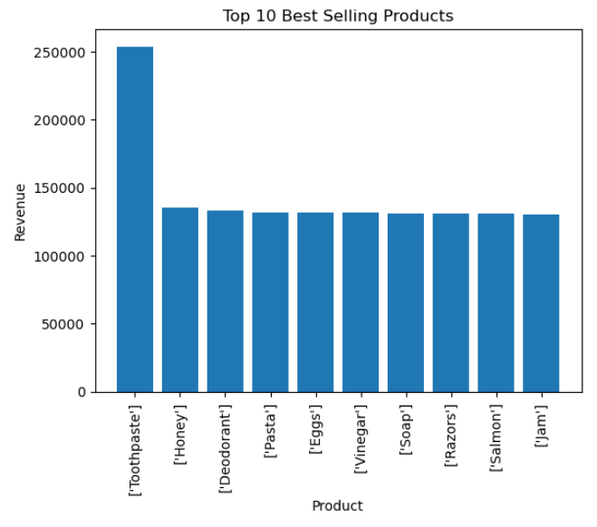
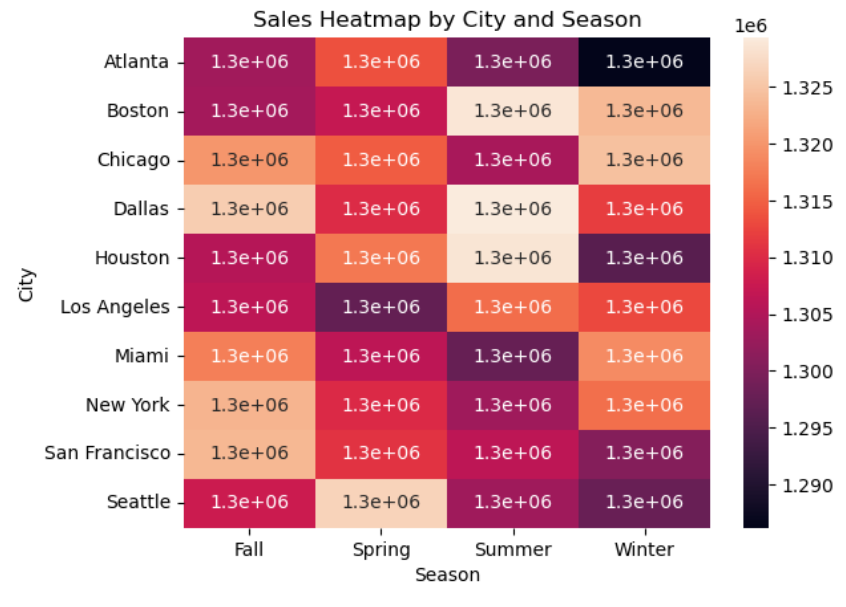

# E-Commerce Sales Analysis & Forecasting

## Overview

This project performs end-to-end analysis of retail transaction data to uncover sales trends, customer behavior, and future demand patterns. It combines **Exploratory Data Analysis (EDA)**, **Customer Segmentation (RFM)**, and **Time-Series Forecasting (ARIMA)** to support data-driven decision making.

---

## Objectives

* Analyze monthly and yearly sales trends
* Identify top-performing products and categories
* Understand geographic sales distribution
* Perform customer segmentation using RFM analysis
* Forecast future sales using time-series modeling

---

## Dataset

* Retail transaction dataset (Kaggle)
* Contains:

  * Transaction ID, Date
  * Customer details
  * Product, Total Cost
  * Payment Method, City, Store Type
  * Promotion and Season

  Dataset not included due to size.

---

## Dataset Access

Download dataset from:
Cleaned retail dataset - https://drive.google.com/file/d/1fTTiPP1tuGnYhPe6ywk2lA4fZOna7ALC/view?usp=drive_link
Cleaned transaction dataset - https://drive.google.com/file/d/1FgV2Wjsu8jw1pLaW9q2KNOZCbi6wHAqb/view?usp=drive_link

---

## Data Cleaning

* Handled missing values (Promotion → "No Promotion")
* Converted Date column to datetime format
* Removed inconsistencies in categorical fields
* Created new features:

  * Year, Month, Day, Day of Week

Ensures accurate and reliable analysis

---

## Exploratory Data Analysis

### Sales Trends

* Identified monthly and yearly fluctuations
* Seasonal peaks observed during promotions and festive periods

### Product Analysis

* Top products contribute major share of revenue
* Seasonal demand patterns identified

### Geographic Analysis

* Certain cities generate higher revenue
* Identified regions for potential expansion

---

## Customer Segmentation (RFM)

Customers segmented into:

* High-Value Customers
* Loyal Customers
* Potential Loyalists
* At-Risk Customers

Helps in targeted marketing and retention strategies

---

## Sales Forecasting

* Model Used: **ARIMA**
* Forecast Period: Next 6 months

### Evaluation Metrics

* RMSE: 7.73
* MAPE used for accuracy evaluation

Enables better inventory and business planning

---

## Visualizations

### Top Selling Products



### Customer Segmentation


### Sales Heatmap (City vs Season)



---

## Key Insights

* Sales show strong seasonal variation
* Few products drive majority of revenue
* Customer segmentation improves targeting
* Forecasting helps in demand planning

---

## Business Recommendations

* Increase inventory for high-demand products
* Run promotions during low-sales periods
* Focus marketing on high-performing regions
* Implement customer retention strategies
* Use forecasting for supply chain optimization

---

## Tools & Technologies

* Python
* Pandas, NumPy
* Matplotlib, Seaborn
* Statsmodels (ARIMA)
* Jupyter Notebook

---

## How to Run

```bash
git clone https://github.com/kanigashree152003/Ecommerce-Sales-Analysis.git
cd Ecommerce-Sales-Analysis
pip install -r requirements.txt
```

Open notebook:

```
notebooks/
```

---

## Author

**Kanigashree R**
MSc Data Analytics

---

